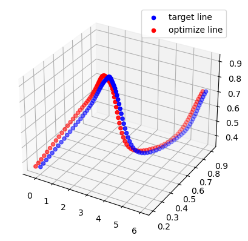
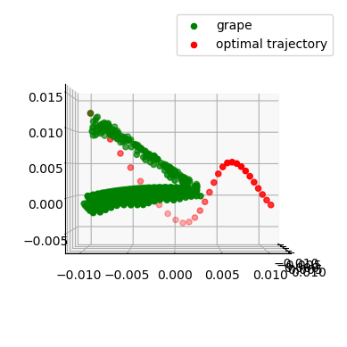
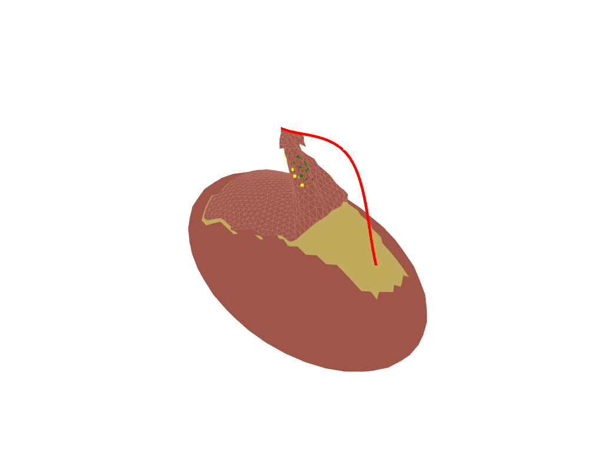

# Simulation-learing
Weekly update for progress
Week1 Feb 23th - Mar 3rd  
Sorry for not recording, busy on course project.  
Ubuntu20.04 installed on laptop  
Week2 Mar 4th -  
Learning on PBD ch3, ch4
ch3 is mainly based on motion modeling.
ch4 in progress
Play with xpbd code (https://github.com/TonyZYT2000/PyPBD). Some confusion why we need to divide to odd and even. A modified version of just horizontal, vertical and diagonal is uploaded. It seems work.
  
Play with grape peeling code. Grape peeling code doubles the surface for one is the real surface and one is fixed boundary. It will first run the dist constrain to simulate the distance then run bounbdary constrain to drag the vertex back due to boundary constrain. The it will calculate the energy on the boundary. When the energy exceed limit, setting it to a very low level to consider it as broken.  

Peel something new, build a plane from PV lib and set the grasp point and the control trajectory.

Week3-5 Mar 27th- April 14
Learning how to use pytorch to optimize control trajectory. Using gradient decsend to optimize trajectory. First pre-define a control trajectory and run the simulation to get target point position. Then reload the model and optimize the trajecotry from initial position.  
The loss is weird since it will suddenly drop at around 500 iterations and converge quickly but from 1-500 it will stay at nealy same loss. I think it might be trying to break the damage constrain for the 1-500 iterations when the boundary is damaged, it will converge soon.
  
  
  

Week5- April 16th -  April 30th
Since the simulation trajectory is weird, if we give the peeling a good initialiaztion like 10-20 step from the ground truth trajectory, it might have a better performance.  

Implement a 3D cubic spline interpolate in pytorch, it support autograd.  

Do a simple optimization test. Config: target trajectory 4 control point and 40 interp points. Optimization trajectory 4 control point 10 interp points to save time in every iteration. The optimal result is sensitive to inital point. 

Add pv plot for the result

Week6 May 1st -  
Try to optimize the boundary energy while peeling the grape. First visulize the energy in peeling.  
![image][PBD_peel/energy.gif]
